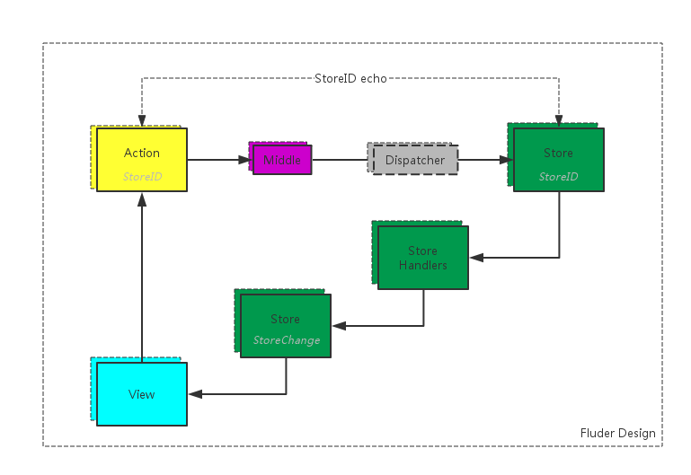

# Fluder
A unidirectional data flow tool based on flux.

更加轻量，更加便捷，更加高效。



## 安装

### npm

使用 npm 来安装 Fluder

```javascript
npm install fluder
```

调用

```javascript
import {
  storeCreate,
  actionCreate,
  applyMiddleware,
  actionStoreCreate
} from 'fluder'

```

API

```
Fluder.storeCreate
Fluder.actionCreate
Fluder.applyMiddleware
Fluder.actionStoreCreate
```

## 介绍

### Fluder Store

**Store** => 数据存储和Handlers管理中心，数据存储仅仅提供了 `读取` 数据的接口

>在 **Views** (也可以说是Controller-Views及React组件）中，只能从 **Store** 中 `读取` 数据，在 **Store Handlers** 中，才能 `写入` (这里的写入不是store提供的API进行写入，而是只有在handlers里面才能读取到store构建的闭包中的数据)和 `读取` 数据。

当数据变化的时候，**Store** 会发送一个数据变化的事件（这个事件会把变化后的 **Store** 和引起变化的 `action payload` 传入，通过这个 `payload` 我们可以优化 **Store** 变化的回调函数的执行）。


### Fluder Actions

和Flux的action概念一致，所有引起数据变化的操作都只能通过 **Action** 操作(比如更新数据/获取数据/删除数据)。前面 **Store** 中提到，只有在 **Store Handlers** 中才能 `写入` 数据，而能让 **Store Handlers** 执行的就是 **Action** 的发送


### Fluder Dispatcher

Fluder里面隐藏了Dispatcher，Action send Map到Store对应的handler后直接执行handler，存储和Map以及__invoke__的操作都是Dispatcher进行，只是在Fluder里面进行了隐藏


### Fluder Middleware

提供一个统一操作Action的API，所有action都需要依次执行中间件队列里面的函数(参数为action的payload)，类似于express框架的中间件统一处理客户端请求


### Fluder Handlers

当 **Action** 触发的时候，**Store** 需要一个与该 **Action** 对应的回调函数来处理 payload 数据，这时可以将数据写入到 **Store** 中。**ActionType** 需要与 **Store** 的回调函数名相对应。


### Fluder Action-Store

**Action** 和 **Store**在创建的时候必须匹配ID，一个Action对应一个Store，当 **Action** 触发的时候可以通过Action的ID Map到需要操作的Store和对应的Store Handlers，这样避免了循环查找所有Store，找到Store里面对应于ActionType的Handler(Action=>Store Change时间复杂度为1),同时避免了Flux里面的Switch case


## API

Fluder.applyMiddleware-中间件

Fluder.storeCreate-创建Store

Fluder.actionCreate-创建Action

Fluder.actionStoreCreate-Action和Store一起创建


* use例子

```javascript
import { applyMiddleware } from 'fluder';
applyMiddleware(function(data, next){
  let {storeId, payload} = data;
  console.info(`actionType: \"${payload.type}\"`);
  console.info(`storeId: \"${storeId}\"`);
  console.log(payload);
  next();
}).applyMiddleware(function(data, next){
  /**
   * 把action里面的异步处理统一放在中间件
   */
  let {storeId, payload} = data;
  
  next();
})
```

* Store例子

```javascript

/**
 * STORE部分
 */
import { storeCreate } from 'fluder';
import constants from '../constants/postConstants';
/**
 * STORE唯一标示，和actionId一一对应
 */
var ERRORTIP_ID = 'ERRORTIP_ID';
/**
 * 注意这里面的一些方法没有用arrow function
 * 原因是函数内部的this是动态绑定到store上面的
 */
let dataTips = {};
let dataTipsIndex = {};
var ErrtipStore = storeCreate(ERRORTIP_ID, {
  /**
   * store数据(states)存储
   */
  getTip: function(name){
    return name?dataTips[name]:dataTips
  },
  getIndex: function(name){
    return name?dataTipsIndex[name]:dataTipsIndex
  },
  getAll: function(){
    return Object.keys(dataTips);
  }
}, {
  /**
   * STORE handlers
   */
  [`${ERRORTIP_ID}/${constants.INIT_ERR_DATA}`]: function(payload){
    return set(payload,dataTips)
  },
  [`${ERRORTIP_ID}/${constants.INIT_COMPONENT_INDEX}`]: function(payload){
    return set(payload,dataTipsIndex);
  },
  [`${ERRORTIP_ID}/${constants.DEL_ERR_DATA}`]: function(payload){
    return del(payload, dataTips)
  },
  [`${ERRORTIP_ID}/${constants.SET_ERR_DATA}`]: function(payload){
    return set(payload,dataTips)
  }
});

function set(payload,dataTips){
  let name = payload.value.actionTarget;
  let val = payload.value.actionValue;
  if (typeof val=="object") {
    for(var k in val){
      if(!val[k]&&val[k]!=0) {
        delete dataTips[k];
        continue;
      }
      dataTips[k] = val[k]
    }
  }else{
    dataTips[name] = val
  }
  return dataTips
}
function del(payload,dataTips){
  let name = payload.value.actionTarget;
  if(!name) dataTips = {};
  if(typeof name == 'string'){
    delete dataTips[name];
  }
  if(Object.prototype.toString.call(name) == "[object Array]"){
    for(let i of name){
      delete dataTips[i];
    }
  }
  return dataTips
}
export default ErrtipStore;

```

* Action例子

```javascript
import { actionCreate } from 'fluder';
import constants from '../constants/postConstants';
const ERRORTIP_ID = 'ERRORTIP_ID';
export default actionCreate(ERRORTIP_ID,{
  setErrData:(data)=>({
    type: `${ERRORTIP_ID}/${constants.SET_ERR_DATA}`,
    value: data
  }),
    delErrData:(data)=>({
    type: `${ERRORTIP_ID}/${constants.DEL_ERR_DATA}`,
    value: data
  }),
  initErrData:(data)=>({
    type: `${ERRORTIP_ID}/${constants.INIT_ERR_DATA}`,
    value: data
  }),
    initErrIndex:(data)=>({
    type: `${ERRORTIP_ID}/${constants.INIT_COMPONENT_INDEX}`,
    value: data
  }),
});
```
* actionStoreCreate例子

```javascript
import { actionStoreCreate } from 'fluder';

import constants from '../constants/postConstants';
const ERRORTIP_ID = 'ERRORTIP_ID';

let dataTips = {};
let dataTipsIndex = {};

export default actionStoreCreate(ERRORTIP_ID, {
  setErrData:(data)=>({
    type: `${ERRORTIP_ID}/${constants.SET_ERR_DATA}`,
    value: data
  }),
  delErrData:(data)=>({
    type: `${ERRORTIP_ID}/${constants.DEL_ERR_DATA}`,
    value: data
  }),
  initErrData:(data)=>({
    type: `${ERRORTIP_ID}/${constants.INIT_ERR_DATA}`,
    value: data
  }),
  initErrIndex:(data)=>({
    type: `${ERRORTIP_ID}/${constants.INIT_COMPONENT_INDEX}`,
    value: data
  }),
}, {
  /**
   * store数据(states)存储
   */
  getTip: function(name){
    return name?dataTips[name]:dataTips
  },
  getIndex: function(name){
    return name?dataTipsIndex[name]:dataTipsIndex
  },
  getAll: function(){
    return Object.keys(dataTips);
  }
}, {
  /**
   * STORE handlers
   */
  [`${ERRORTIP_ID}/${constants.INIT_ERR_DATA}`]: function(payload){
    return set(payload,dataTips)
  },
  [`${ERRORTIP_ID}/${constants.INIT_COMPONENT_INDEX}`]: function(payload){
    return set(payload,dataTipsIndex);
  },
  [`${ERRORTIP_ID}/${constants.DEL_ERR_DATA}`]: function(payload){
    return del(payload, dataTips)
  },
  [`${ERRORTIP_ID}/${constants.SET_ERR_DATA}`]: function(payload){
    return set(payload,dataTips)
  }
})

function set(payload,dataTips){
  let name = payload.value.actionTarget;
  let val = payload.value.actionValue;
  if (typeof val=="object") {
    for(var k in val){
      if(!val[k]&&val[k]!=0) {
        delete dataTips[k];
        continue;
      }
      dataTips[k] = val[k]
    }
  }else{
    dataTips[name] = val
  }
  return dataTips
}
function del(payload,dataTips){
  let name = payload.value.actionTarget;
  if(!name) dataTips = {};
  if(typeof name == 'string'){
    delete dataTips[name];
  }
  if(Object.prototype.toString.call(name) == "[object Array]"){
    for(let i of name){
      delete dataTips[i];
    }
  }
  return dataTips
}
```


